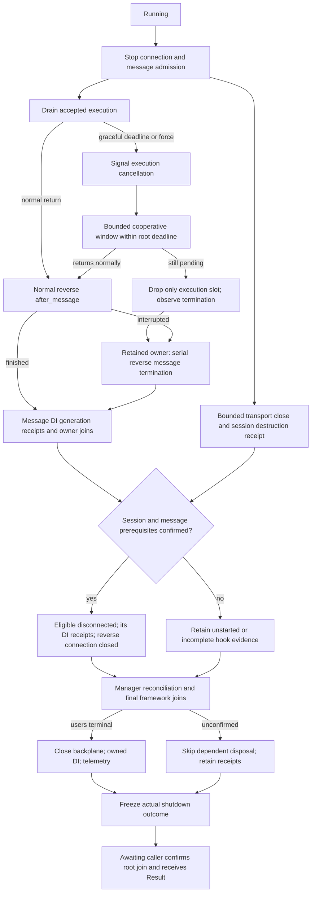

# Shutdown architecture and implementation status

## Host-owned background services

`WsAppBuilder::add_background_service` uses `lily_background_service`'s shared
supervisor. Worker constructors are retained before their initialization await;
execution is released only after listener bind and required backplane readiness.
The host observes worker errors/panics alongside its other shutdown triggers.
Successful one-shot completion leaves the listener running.

The adapter in `src/app/background.rs` receives the coordinator's original
graceful and hard cutoffs. It cancels worker tokens immediately when these
shutdown limits are published, projects execution/scope/reconciliation cutoffs
inside the existing user-work boundary, and reserves the same dependency tail
as connection cleanup. It does not use the per-message cooperative cap.
A retained monitor observes force requests even while the coordinator is
waiting for a different component. Reconciliation includes that monitor's join.

Background task and exact scope-generation receipts participate in the root's
dependency barrier. Aborting a task is not a terminal receipt. Incomplete joins
retain the application, container, dispatcher and tracing owner; late completion
does not rewrite the frozen report. Background application failures remain
failures even when resource disposal subsequently succeeds. Factory scopes are
isolated from message scopes and other scopes in an external container.

An unstarted app's last handle transfers prepared workers to the same close
path. Background constructor failure/cancellation transfers all build resources
to a retained rollback owner with a single absolute deadline for worker stop,
scope cleanup, backplane close, DI close and telemetry. The pre-existing DI
initialization rollback remains responsible for failures before workers are
constructed. `BackgroundCancellation` aliases the shared host token while the
WebSocket-specific `ExecutionCancellation` continues to govern callbacks.

See the [background qualification matrix](SHUTDOWN_QUALIFICATION.md#background-services)
and [public usage guide](README.md#background-services).

Phases 1–9 are implemented. Earlier phase sections describe their incremental
changes; Phase 5 defines message unwind and Phase 6 defines connection eligibility
and termination barriers. Phase 7 defines outbound continuation during drain.
Phase 8 implements final task/receipt reconciliation and dependency barriers.
Phase 9 adds aggregate evidence, a [migration guide](SHUTDOWN_MIGRATION.md),
and an executable [qualification matrix](SHUTDOWN_QUALIFICATION.md).
The [message execution contract](MESSAGE_TIMEOUT.md) defines the shared local
deadline, per-message cancellation, cooperative result preservation and
connection continuation policy.
The message-timeout sessions are complete, including [result/output evidence](MESSAGE_TIMEOUT.md#reporting-and-completion-evidence)
and [qualification](SHUTDOWN_QUALIFICATION.md#message-deadline-and-cooperative-result-qualification).

## Phase 1: ownership contract and lifecycle accounting

Phase 1 implements internal lifecycle records and connects them to the existing
message middleware unwind, connection middleware unwind, and connection cleanup
worker join receipts. It does not yet implement the final shutdown coordinator.
Phase 1 left callback signatures and runtime scheduling unchanged. The following
phase sections describe subsequent changes to cancellation, owners and hooks;
Phase 7 below implements outbound continuation.

## Phase 2: read-only signals and callback plumbing

`ExecutionCancellation` and `CleanupCancellation` expose only `Clone`, bounded
`Debug`, `is_cancelled()`, and `cancelled().await`. Their fields and constructors
are private to the framework. There is no public cancellation method, child
authority, raw-token conversion, `Deref`, or conversion between signal types.
Dropping a view or its wait future cannot cancel its source.

| Callback / extractor | Signal |
| --- | --- |
| Handshake `handle`, identity `identify` | `ExecutionCancellation`, also exposed by the handshake exchange |
| Connection `admit`, `opened` | `ExecutionCancellation` parameter |
| Message `before_message`, normal `after_message` | `ExecutionCancellation`, also exposed by the message exchange |
| Message `on_message_termination` (Phase 5) | Per-invocation `CleanupCancellation`, also exposed by the termination context |
| Global/controller/action `can_activate` | `ExecutionCancellation`, also exposed by the message exchange |
| Message action, `#[connected]` | Optional `ExecutionCancellation` argument through typed extraction |
| Connection `closed` | `CleanupCancellation` parameter |
| `#[disconnected]` | Optional `CleanupCancellation` argument through typed extraction |

Exchange accessors and callback parameters are clones of the same execution
signal. Message middleware execution now derives its cancellation boundary from
the exchange, removing the separate token argument which could disagree with
that context. `WebSocketMessageInvocation` and `WebSocketMessageContext` also
expose only the read-only execution signal.

Lifecycle invocation state stores either an execution or cleanup signal.
Custom lifecycle extractors use `execution_cancellation()` or
`cleanup_cancellation()`, each returning `Option<&...>` for its phase. Generated
adapters reject cleanup extraction on message/connected callbacks and execution
extraction on disconnected callbacks at compile time. The internal extractor
also rejects a mismatched invocation instead of manufacturing another signal.

The connection cleanup registry supplies its existing hard-cleanup authority
to the disconnected adapter. Each `closed` invocation and each disconnected
handler receives a separate child signal. A framework-owned drop guard ends
that child's authority when the invocation completes, times out, panics, or its
owner is dropped. The root and sibling signals remain unaffected. Root cleanup
cancellation propagates to all children; execution cancellation remains a
different authority. A cancelled cleanup view indicates an ended/cancelled
invocation authority, not successful resource disposal.

These changes add no background tasks or new timeout windows. Existing timeout
and force paths may still drop execution or cleanup immediately. Phase 2 does
not guarantee that a callback observes a cancellation wake before it is dropped.
Phase 3 retains execution owners; Phase 4 adds the bounded cooperative window
and root-budget propagation. The new message termination hook remains Phase 5.

### Phase 2 migration

- Add the signal as the last parameter of each overridden middleware/guard
  callback. Constructors and synchronous descriptors are unchanged.
- Replace message/connected `Cancellation` extraction with
  `ExecutionCancellation`; use `CleanupCancellation` in disconnected handlers.
  The deprecated `Cancellation` name aliases the read-only execution type only.
- Remove tuple-field, `into_inner()`, `Deref`, `.cancel()`, and `.child_token()`
  usage. Cancellation source ownership stays in Lily.
- Replace a custom lifecycle extractor's old raw `invocation.cancellation()`
  access with the accessor for its lifecycle phase.
- The host-controlled `WsApp::start_with_cancellation` input remains a raw
  source supplied by the host. It does not expose Lily's callback authorities.

Phase 2 initially left `after_message` as the interim abnormal-unwind path.
Phase 5 below replaces that scheduling with a separate termination callback.

## Phase 3: retained lifecycle owners and execution slots

Message dispatch now has two distinct lifetimes. `MessageDispatchRegistry`
registers an owner before its first poll and retains its actual `JoinHandle`
through a shared join receipt. The owner keeps its DI scope open around
`MessageLifecycleOwner`, which holds the exchange and entered middleware ledger.
`ExecutionSlot` borrows this state while running before hooks, guards, the action
and, since Phase 5, normal `after_message` unwind. Registry force can stop only
that slot; the owner retains termination unwind and scope close independently.
`OwnedMessageDispatch` retains the ledger and exchange in the scoped operation's
result while DI close is pending; the surrounding owner releases that state
only after the scope's explicit close returns.

```text
MessageDispatchRegistry (owner task + join receipt)
  -> retained DI scope / generation-bound cleanup receipt
  -> MessageLifecycleOwner (exchange + entered ledger)
       -> replaceable ExecutionSlot (before -> guards -> action -> normal after)
       -> observed execution return / panic / slot drop
       -> if interrupted: serial reverse on_message_termination
  -> explicit scope close and disposal result
  -> observed owner task join
```

A successful middleware enter is recorded immediately, before diagnostics or
the next callback. A later pending before hook therefore cannot take the entered
prefix with it when the slot is dropped. Reverse hooks also borrow the ledger;
their accounting is no longer owned by an `after_message` result future.
Execution panic is contained at the slot boundary. Slot abort requests and
confirmed slot drops are counted separately, and neither is a task join.

`ConnectionLifecycleOwner` is the retained entry in
`ConnectionCleanupRegistry`. The connection/transport future holds a lease;
its drop starts the same owned finalizer. That finalizer waits for this
connection's message-owner joins and scope cleanup receipts before running
controller/middleware cleanup. It checks scope receipts again after the
controller terminal stage, because a dropped disconnected hook can have
DI-owned disposal still running. Finalization retains the existing exclusive
claim and reverse connection middleware order.

`ScopeCleanupRegistry` records the exact DI scope generation before any user
work is polled. Handshake, connected, message, and disconnected scopes all use
it. A cancelled scope waiter cannot discard the receipt. DI owns and runs the
disposal; Lily observes its termination through the existing generation-bound
DI observation mechanism. The added `lily_injection::__private` bridge only
exposes the existing observation without imposing another deadline. An observed
termination is **not** a successful disposer result: explicit close errors still
propagate to the caller, and DI's canonical shutdown ledger retains disposal
errors when a callback waiter is interrupted.

Message, scope, and connection cleanup receipt drivers are registered in task
trackers. The server reconciles message owner joins, connection finalizers,
and scope receipt drivers before proceeding to its dependency cleanup.
Per-connection barriers use registered children, not an untracked cleanup task
or cancellation of another connection's execution.

### Phase 3 boundaries and validation

Phase 3 changed no callback signature or user-facing shutdown configuration.
It kept `after_message` as the interim unwind path, including interrupted
execution; Phase 5 below implements its separate termination replacement.
Phase 3 retained publication-based `#[disconnected]` arming and introduced the
child-owner barrier. Phase 6 below replaces that arming rule and adds the full
session/transport prerequisite and skipped-obligation evidence.

Phase 3 initially retained owners with immediate force triggers and unbounded
prerequisite waits. Phase 4 below replaces those triggers and bounds the waits.
Final abort of the server/coordinator, backplane and container dependency
reconciliation is implemented in Phase 8 below; retained local receipts alone do not
prove that a dropped root coordinator has joined all framework work.

Qualification covers abort before/after execution's first poll, panic,
registration before first poll, dropped receivers, force during owner cleanup,
per-connection isolation, generation reuse, and tracked driver termination.
Real middleware/guard/action cases verify retained reverse order and hold a DI
disposer pending to prove that owner completion waits for disposal. Separate
tests cover disconnected timeout with a surviving DI receipt and connection
lease drop with force already requested while child receipts remain pending.

## Phase 4: absolute deadlines and cooperative execution cancellation

The coordinator now publishes its absolute graceful and hard deadlines to
registered components before starting any shutdown callback. Before each force
request it also publishes that component's effective force deadline, capped by
the root hard deadline. WebSocket owners share one `ShutdownBudget`; a watch
channel shortens already-pending waits when force begins. These are owner-polled
timers, with no detached timer or cleanup tasks. Repeated publication never
extends a deadline. `MessageDeadline` remains a copyable snapshot of the normal
message deadline (or the separate connection lifecycle invocation limit); it cannot extend the owner's authority when a later force request
shortens that limit. The coordinator also uses absolute timeout boundaries, so
converting remaining time to a later relative timeout cannot extend its cap.

The coordinator's existing force reserve remains `min(total / 4, 2 seconds)`
inside the configured total timeout. Within the effective WebSocket force cap,
the internal policy is (no new public configuration):

```text
F = time force is requested
H = min(root hard deadline, component force deadline)
R = max(H - F, 0)

execution cutoff = min(previous cutoff, F + min(250 ms, R / 4))
transport cutoff = min(previous cutoff, F + 2 * R / 3)
cleanup cutoff   = min(previous cutoff, H - min(25 ms, R / 4))
final receipt reconciliation ends at H
```

For example, with 250 ms remaining, execution gets up to 62.5 ms to cooperate,
transport has time until approximately 166.7 ms for message cleanup and terminal
output, cleanup has time until 225 ms, and the final 25 ms is reserved for
termination receipts. The transport cutoff leaves a connection-cleanup tail
even for small, nonzero budgets. Unfinished message cleanup may outlive transport,
but must finish before dependent connection hooks can start. A small or exhausted root budget shortens
these windows; they are never added after the total timeout. Separate
connections share the same cutoffs. Connection hook/handshake caps still apply.
A message deadline signals its isolated execution source and permits at most
250 ms of continued normal execution, clipped by these root limits. A local
peer/identity cancellation outside root shutdown uses a maximum 250 ms cooperative window, also clipped by any
subsequently published root limit. Internal standalone force callers with no
composition root establish one bounded 500 ms fallback cap; production startup
publishes the root cap before requesting force. The standalone connection
cleanup API's explicit deadline is its total cap, with its receipt reserve
inside that cap.

```text
Running
  -> stop connection and message admission
  -> graceful drain: accepted execution keeps running
       -> normal reverse after_message -> message scope close
       -> connection cleanup prerequisites -> connection hooks -> removal

Graceful cutoff / explicit force
  -> publish effective cutoffs
  -> signal accepted execution_cancel
  -> keep polling accepted execution during cooperative window
       -> cooperative return / user failure / panic: observe terminal result
       -> still pending at cutoff: drop only execution slot
  -> retain MessageLifecycleOwner, entered ledger and scope receipt
  -> serial reverse cleanup within cleanup cutoff
  -> on scope-cleanup expiry, DI owns disposal abort and termination observation
  -> confirm original scope close and owner joins within final receipt cap
  -> connection prerequisite check
       -> confirmed: eligible controller/connection cleanup within budget
       -> unconfirmed: skip dependent user hooks and report incomplete
  -> framework manager cleanup and observed connection worker joins
  -> report actual outcomes plus outstanding receipts
```

Connection tasks own the parent execution source. Every accepted message gets
an isolated child source shared by its slot, callback parameters, context and
action extractor. Local message expiry cancels only that child. Stopping listener
admission does not cancel accepted execution. During a message's cooperative
window, returning before middleware/guards may proceed to the action and normal
reverse callbacks; none gets a fresh window. Completing the entire normal
pipeline preserves its success or ordinary application error. A returned action
alone cannot rescue an interrupted normal reverse exit. Handshake and connection
startup invocations keep their separate local caps and eligibility rules.

`MessageDispatchRegistry` binds each slot to the actual callback source before
spawning its owner. Slot cancellation and abort requests are separate from
observed terminal outcomes. The connection drainer publishes cancellation before
its cooperative wait. Message slots enforce the earlier execution cutoff;
connection/transport slots retain time for message cleanup and terminal output
until the transport cutoff. Both the session and drainer observe that cutoff;
remaining connection task abort requests require actual joins. Message lifecycle owner tasks are never that abort
target. A panic from a user destructor while dropping an execution slot is
contained before the retained owner starts unwind. Connection terminal-stage
panic containment also covers cancellation/drop before manager cleanup.

Cleanup invocation scheduling is separate from the execution stop boundary.
A pending cleanup observes dynamic root limits; a fresh cleanup future is not
polled after its budget expires. The former global terminal-first-poll barrier
has been removed. It could hold force forever behind a pending prerequisite and
could not justify completion of partially polled hooks. Reverse middleware
ledgers now retain `started: false` when an expired authority prevents invocation.
A local hook timeout still ends only that invocation's child authority; exhausting
the shared root budget legitimately prevents later hooks from starting.

DI observation clones retain the exact scope generation. On cleanup expiry the
observer asks the DI owner to terminate that generation's disposal and continues
to observe it. `run_scoped` retains the original `close()` future and its result
(which contains the message ledger) through the final receipt window. Calling
`close()` again would incorrectly return success for an already-closed scope.
Only an observed DI termination resolves the receipt; a deadline request alone
does not. Disposal timeouts remain failures in DI's canonical shutdown ledger.

Local reports now retain outstanding message owners, outstanding DI receipts,
DI disposal deadline failures, and connection prerequisite failures. Message
cleanup failures occurring after root shutdown begins remain counted after the
owner joins and its entry is removed; an empty registry cannot erase them. Connection
abort requests without observed joins are reported explicitly. A joined cleanup
worker with a timed-out user hook does not make server shutdown successful.
Expired waits never remove outstanding registry evidence to manufacture success.
A server-drain error also remains an error on a coordinator force retry. The
managed server distinguishes runtime results already retained by the main
lifecycle select from cleanup errors first observed during drain; observing a
join cannot erase the latter.

### Phase 4 boundaries and validation

Callback signatures and read-only wrapper APIs are unchanged from Phase 2.
`lily_shutdown::FrameworkShutdownComponent` gains two additive methods with
no-op defaults: `set_shutdown_deadlines` and `set_force_deadline`. The hidden DI
scope observation becomes cloneable; it still grants no public cancellation
source. The shared coordinator uses Tokio's monotonic clock for both deadlines
and waits, permitting deterministic qualification with paused time.

Phase 4 left `after_message` as the interim abnormal unwind path. Phase 5 below
replaces it and puts normal reverse callbacks inside the execution slot.
Phase 6 below implements connected-success arming and the complete
session/transport prerequisite. Phase 7 below implements outbound policy.

Phase 4 bounds local owner waits and preserves/reports their unfinished receipts;
it does not claim final root reconciliation. A receipt driver or non-terminated
owner can still remain tracked after an incomplete root wait. The existing
`ManagedWsServer::Drop` abort, maintenance/backplane shutdown and dependency
ordering are addressed by Phase 8 below. Phase 9 below implements the consolidated internal report and release qualification.
No Tokio deadline can preempt application code which blocks a poll or destructor
without yielding; the new windows are async scheduling bounds, not process-level
preemption guarantees.

Qualification covers cooperative return in handshake, identity, admit, opened,
message middleware, guard, action and connected callbacks; handshake peer/early-data
termination racing force without skipping cooperation or losing HTTP rejection;
pending execution slot
abort; slot destructor panic; dynamic root publication and deadline shortening;
no fresh hook poll after expiry; local cleanup sibling isolation; unmet child
prerequisites; pending DI disposal termination with a retained timeout result;
real connection cleanup failures; and outstanding owner reporting. The existing
reverse-order, dropped-waiter, scope-generation, join and callback type-contract
tests remain in the suite.

Phase 4 validation: 436 WebSocket unit tests passed (one existing ignored),
18 shared coordinator tests passed, and the derive, UI, integration and doc
suites passed. This phase adds 15 WebSocket tests and one coordinator test.
The downstream fixture compiles with `--offline --locked`. Clippy covers all
targets including `fuzzing`; only the four pre-existing WebSocket warnings remain.

## Phase 5: separate normal unwind and message termination

`after_message` is normal execution, including ordinary returned rejection,
close and error outcomes. Its signature and response-decision rules remain
unchanged. It now runs inside the replaceable execution slot. An accepted
invocation can return after cancellation and continue normal reverse hooks
within the existing cooperative boundary; cancellation alone does not select
termination or report an abort.

The additive `WsMessageMiddleware::on_message_termination` default does nothing:

```rust,ignore
async fn on_message_termination(
    &self,
    context: WsMessageTerminationContext<'_>,
    cancellation: CleanupCancellation,
) -> Result<(), WsMiddlewareError>;
```

The invocation-scoped context provides the original connection/request metadata,
principal, message/connection locals, message-scope service resolution, observed
message outcome, termination reason, previous normal-exit evidence and current
effective cleanup deadline. Its cancellation accessor and the callback argument
are clones of the **same cleanup signal**. It exposes neither a mutable response
decision nor the execution exchange/token. Locals can be updated or removed
serially for the remaining outer cleanup hooks. DI remains open through unwind.

### Eligibility and ordering

The owner selects termination from observed framework interruption, never from
a user-selected error code or merely from `is_cancelled()`. A framework timeout
or cancellation of a before/guard/action future, confirmed execution-slot drop,
or an escaping execution panic leaves entered obligations for termination.
Caught handler/guard panics which the existing adapters translate into a terminal
message result retain normal unwind. Returning a timeout/cancelled *error* also
remains a normal terminal return. These distinctions preserve existing error
handling while covering actual cut-short futures, including local timeouts
outside server shutdown.

Only `before_message -> Continue` enters a middleware. A rejecting, failed,
panicked or interrupted before hook creates no exit for itself. Each entered
middleware has at most one normal exit and one eligible termination exit:

| Normal exit evidence | Termination eligibility |
| --- | --- |
| Never claimed | Eligible when message execution/unwind was interrupted |
| Claimed/running | Ineligible until the owner observes actual return/drop |
| Interrupted, first poll observed or not | Eligible; original evidence retained |
| Completed, returned error, or panicked | Ineligible; no second exit |

If normal unwind is interrupted, it stops at that entry. Outer normal hooks do
not overtake that inner termination obligation. The retained owner observes the
slot's drop, resolves any active normal-exit record, and walks the outstanding
entries in reverse order. Poll and destructor panics are contained per cleanup
invocation so that remaining outer entries can still run. Serial cleanup never
spawns another task. Its repeated entry claim cannot invoke a hook twice.

```text
Normal / graceful:
  before global -> controller -> action
  -> guards -> action
  -> normal after action -> controller -> global (inside execution slot)
  -> observed slot return -> message scope close -> actual owner join

Force / graceful deadline:
  execution_cancel -> bounded cooperation (Phase 4 absolute cutoff)
    -> terminal normal execution/unwind: retain its completed exits
    -> still pending: stop only execution slot, observe its drop
  -> retained owner: outstanding termination action -> controller -> global
  -> message DI close / generation receipt -> actual owner join

Example: force during controller's after_message:
  action.after completed
  -> controller.after starts, then is interrupted and dropped
  -> controller.on_message_termination
  -> global.on_message_termination
  -> message DI close
  (action does not receive termination; global does not start normal after)
```

### Cleanup authority and budgets

`MessageLifecycleOwner` owns a fresh cleanup source independent of its execution
source. Every termination invocation uses a separate child source. The framework
ends that child's authority on return, panic or cutoff, **before dropping a
pending user future**. This does not promise another poll after cancellation.
Cloned signals therefore describe ended authority, never successful cleanup.

Normal reverse execution shares the absolute `message_timeout_secs` deadline
with forward middleware, guards, extraction, action and response preparation,
subject to the shared cooperative/execution/root limits. Reaching the normal
deadline signals cancellation; it does not immediately drop the pipeline. Normal
reverse exit receives no new deadline or cooperative window.
Once termination begins, its entire tail receives at most one
`message_cleanup_timeout_secs` cap clipped by the current root cleanup deadline.
It does not reset the root or its reconciliation reserve. Without a root shutdown,
the termination cap remains independent of elapsed normal execution.
See [the message timeout contract](MESSAGE_TIMEOUT.md) for its session status.

For each eligible termination entry, `N` is the number of remaining eligible
hooks and `R` is the time left under the owner/root cap:

```text
owner_end = min(termination_start + message_cleanup_timeout, root_cleanup_end)
invocation_end = now + remaining(owner_end, root_cleanup_end) / N
effective invocation end = min(invocation_end, later root_cleanup_end)
```

Fast hooks leave unused time for later hooks. A pending inner hook exhausts only
its share; its child token cannot cancel a sibling. Root expiry/shortening may
still prevent all remaining hooks from starting. There is no first-poll allowance
after a deadline and no sum of fresh per-hook shutdown timeouts.

### Evidence, migration and phase boundary

Normal and termination invocation records survive slot interruption and stay
with the exchange through the message scope close receipt. Termination records
distinguish completed, returned failure, panic and interruption, with a first-poll
flag. `started: true` cannot identify application side effects. A successful
termination does **not** erase a timed-out or aborted normal exit. During shutdown,
failed or unstarted termination invocations feed the existing retained cleanup-failure
counter even after the owner joins and its active registry entry disappears.
Structured tracing includes the termination stage, invocation evidence and
cancellation-request flag. Phase 9 below adds consolidated shutdown reporting.

Existing middleware implementations compile because the callback has a default.
Move abnormal cleanup previously relying on `after_message` into the new hook;
retain normal response/postprocessing in `after_message`. Shared cleanup logic
must handle `context.normal_exit()` indicating partial normal execution, and
must tolerate being dropped itself. No user callback completion is guaranteed.
RAII/local state or DI ownership remains preferable for framework-critical
resources. Raw application tasks remain outside Lily tracking.

Phase 5 did not change `#[connected]`/`#[disconnected]` arming or transport
barriers; Phase 6 below implements those changes. Phase 7 implements outbound
policy; Phase 8 below adds final root task/dependency reconciliation.
Blocking polls/destructors cannot be preempted by an
async deadline. Qualification covers local and forced interruption during
before/guard/action/after, cooperative return including after, reverse and
exactly-once exit selection, child authority isolation, root expiry/shortening,
poll/drop panic, retained DI ordering, incomplete-work accounting, public type
contracts, and the message-chain fuzz harness.

Phase 5 validation: 444 WebSocket unit tests passed (one existing ignored),
18 shutdown tests, 29 derive tests, 22 UI cases, three integration tests and all
doc tests passed. Eight new lifecycle/cleanup tests and one additional fuzz
adapter test were added; all six fuzz adapter smoke tests passed. Clippy passes
for all targets with `fuzzing`, with only the four pre-existing warnings. The
downstream fixture and standalone message-chain fuzz target compile offline
with locked dependencies. The fuzz workspace lockfile was synchronized with
`lily_trace`'s already-existing `futures-util` dependency; no version changed.

## Phase 6: connected eligibility and connection termination barriers

Framework cleanup and user disconnect eligibility now have separate boundaries:

```text
Register connection owner with session, message and DI receipt gates
  -> connection admit (retain the successfully admitted middleware prefix)
  -> manager publication
       -> transfer manager cleanup obligation to the connection owner
  -> middleware opened
  -> actual controller #[connected] returns Ok(())
       -> arm the matching user #[disconnected] obligation
  -> close connect DI scope
  -> message/transport loop
```

The cleanup owner and its prerequisite gates are published to the registry in
one operation, before any connection middleware is polled. Manager publication
adds framework registration cleanup; it does not arm the user callback. An
`opened` failure, or a failed, panicking, timed-out or forcibly stopped
`#[connected]`, does not arm `#[disconnected]`. Admitted middleware retains its
reverse `closed` obligation, including failure before manager publication.

Arming happens inside the connect scope immediately after the handler's
successful result, before awaiting scope disposal. If connect-scope disposal
then blocks, fails or its waiter is cancelled, the eligible callback survives
in the connection owner's ledger. Cooperative cancellation followed by an
observed `Ok(())` also counts as success. A controller with only
`#[disconnected]` has no successful connected callback and is not implicitly
armed. Applications requiring that callback must provide a successful
`#[connected]` (which may be a no-op).

`ConnectionSession` owns the entire post-upgrade startup/transport future,
including both split WebSocket halves. It explicitly destroys that future
before sending its termination receipt, on ready return or Drop. Queueing or
writing a Close frame is not transport termination. A cancelled receipt sender
is not proof either: if an owned destructor panics, no success value is sent.
This receipt proves inline future destruction; the root connection task still
requires its actual task join result. No new task or timer is introduced.

Graceful completion follows:

```text
Stop new connection/message admission
  -> accepted message execution + reverse normal after_message
  -> message DI scope termination and owner result
  -> bounded transport Close/peer acknowledgement
  -> destroy the complete session, publish its receipt
  -> connection owner observes session receipt
  -> observe actual message-owner joins and exact DI scope receipts
  -> mark manager entry Closing
  -> eligible #[disconnected] with independent CleanupCancellation
  -> observe disconnect-scope termination receipt
  -> reverse admitted connection middleware closed
  -> manager removal
  -> cleanup worker join receipt
```

Forced completion preserves the same prerequisites for the user callback:

```text
execution_cancel -> bounded cooperative window within the root deadline
  -> stop remaining execution slots; retained message owners unwind
  -> session/transport destruction AND message owner + DI termination receipts
       [both are required; transport can end before forced message cleanup]
  -> if confirmed and cleanup budget remains:
       eligible #[disconnected] -> its DI receipt -> reverse closed
  -> otherwise: skip dependent user cleanup, record incomplete/not-started
  -> bounded framework manager cleanup and worker join observation
```

Waiting for the session first also stops the message producer before the owner
snapshots child receipts. An initially empty message registry cannot let cleanup
overtake a reader that registers a later message. Different connections have
independent barriers and may finalize concurrently; hooks within a connection
retain serial reverse order. The original absolute cleanup/root deadlines bound
all these waits; Phase 6 does not add per-barrier timeout extensions.

During `#[disconnected]`, the current caller has no live transport and sends to
it fail. The context still permits DI access and operations targeting other
healthy connections. Qualification verifies both behaviors. This does not
promise delivery during server drain. Phase 7 below implements bounded
invocation-scoped outbound admission.

Internal connection reports now distinguish `session_incomplete`, unmet
prerequisites, and eligible terminal hooks `not_started`. A missing prerequisite
does not count as a completed connection. Per-connection tracing records the
unmet barrier even when no controller callback was armed; the shutdown drain
report aggregates these counters. These observations do not claim successful
DI disposal merely because its task terminated. Full per-invocation outcome
aggregation is implemented in Phase 9 below; Phase 8 below adds final root/dependency reconciliation. Blocking user polls/destructors still cannot be preempted by Tokio.

Qualification covers actual duplex WebSocket startup failure/panic, force with
cooperative and non-cooperative connected callbacks, direct task abort followed
by a confirmed JoinError, peer close racing shutdown, physical transport Drop
before user hooks, same-caller rejection and another target's send, a controller
without connected, success followed by a pending DI close, late message-owner
registration, retained message cleanup/DI receipts, concurrent connection
barriers, and pending/lost session receipts. Receipt unit tests also cover an
unpolled session, a completed future with retained fields, destructor panic, and
the distinction between abort request and confirmed task termination.

Phase 6 validation: 453 WebSocket unit tests passed (one existing ignored),
including nine new tests; 18 shutdown tests, 29 derive tests, 22 UI cases,
three integration tests and all doc tests passed. All six fuzz adapter smoke
tests passed. The downstream fixture and standalone lifecycle/message fuzz
targets compile offline with locked dependencies. All-target Clippy with
`fuzzing` passes with the same four pre-existing warnings; formatting and
`git diff --check` pass. Phase 6 changes no public callback signature or lockfile.

## Phase 7: bounded outbound continuation during drain

Previously, `WebSocketDispatcher::begin_drain` rejected every later `dispatch`,
including a send awaited by an already-admitted action. It counted only sends
that had started before drain, so graceful action completion did not preserve
the ability to attempt its next send. Phase 7 separates new external dispatch
from continuation inside a framework-owned callback.

### SignalR reference and Lily's contract

The reference is pinned to ASP.NET Core **v10.0.0**. SignalR's
[`HubConnectionContext.WriteAsync`](https://github.com/dotnet/aspnetcore/blob/v10.0.0/src/SignalR/server/Core/src/HubConnectionContext.cs)
checks the target connection's aborted state on both fast and lock-waiting
paths. An aborted write can return successfully without sending; write failures
can be caught and converted into connection abort. Thus awaiting send is not a
client-delivery acknowledgement. Abort cancels pending flushes and synchronizes
writes before completing its receipt.
[`HubConnectionHandler`](https://github.com/dotnet/aspnetcore/blob/v10.0.0/src/SignalR/server/Core/src/HubConnectionHandler.cs)
attempts Close using a framework-only abort bypass, then awaits abort before
the user disconnected callback. The
[`DefaultHubDispatcher`](https://github.com/dotnet/aspnetcore/blob/v10.0.0/src/SignalR/server/Core/src/Internal/DefaultHubDispatcher.cs)
initializes the disconnected callback's hub with its normal client facilities;
[`DefaultHubLifetimeManager`](https://github.com/dotnet/aspnetcore/blob/v10.0.0/src/SignalR/server/Core/src/DefaultHubLifetimeManager.cs)
routes sends through each target's write path.

Lily adopts the principle that an admitted callback may **attempt** outbound
work while the target and its budget permit it. Lily's private invocation
authority is its own design, not a claimed SignalR guarantee. It does not keep a
target alive, reserve all future sends, ensure remote delivery or grant the
framework's protocol-close bypass to application code. Existing typed queue
admission and backplane receipts remain explicit rather than copying SignalR's
successful no-op behavior.

| Caller / boundary | Running | Draining | Execution force | Dependency close / root expiry |
| --- | --- | --- | --- | --- |
| External app dispatcher / retained proxy outside a callback | Ordinary bounded admission | Rejected before side effects | Rejected | Rejected |
| Admitted connection `admit` / `opened` / `#[connected]` | Bounded execution authority | May attempt sends | May attempt sends until the shared cooperative/execution cutoff | Rejected |
| Admitted message before / guard chain / action / normal after | Bounded execution authority | May attempt sends until that invocation ends | May attempt sends until the shared cooperative/execution cutoff | Rejected |
| Message termination / `#[disconnected]` / connection `closed` | Bounded cleanup authority | May attempt sends | Separate cleanup signal and deadline still apply | Rejected |

Every target still passes the existing connection-generation, Connected state,
identity-expiry, count-capacity and byte-capacity checks. The closing caller is
not a live target. Other connections may independently be closing; multi-target
receipts can therefore be partial. Handshake APIs do not expose a connection
client facade. Low-level `ConnectionManager` methods retain their existing
node-local contract and do not gain dispatcher/backplane semantics.

### Ownership, deadlines and publication

```text
Stop listener/message producers; close new external dispatch admission
  -> Draining
       -> accepted callback is polled inside a private outbound authority
       -> each send acquires a tracked dispatch lease
       -> validate local target generation/state/capacity
       -> local queue admission
       -> bounded backplane publish, if configured
       -> receipt or honest interruption/error
       -> callback returns/drops/panics: revoke that invocation's authority
  -> connection/message/cleanup owners finish their existing lifecycle
  -> dependency close seals ALL new dispatch, including cleanup continuations
       -> wait existing dispatch leases
       -> stop ingress, close provider
  -> Closed
```

The authority is private Tokio task-local state bound to one exact app
dispatcher. Each callback gets a separate lifetime source which is revoked on
return, panic or Drop, including sends that were polled but not completed.
Keeping a context/proxy or merely constructing a send future does not preserve
drain authority. A raw `tokio::spawn` does not inherit it; application-owned
tasks remain outside Lily's task ownership contract. No new task, public token,
detached cleanup worker or per-callback timer driver is introduced.

Execution sends share the accepted invocation's cooperative/execution cutoff.
The cancellation notification itself does not stop an admitted message send;
the same pipeline can complete normal response preparation and reverse exit
within its bounded window. Its terminal reply additionally requires normal or
termination unwind, DI close and the exact message owner join, and has separate
bounded framework authority. Cleanup sends ignore the execution force signal and use their own invocation token,
local cap and dynamically shortened owner/root cleanup deadline. Every dispatch
also observes the dispatcher's absolute root hard deadline. Local queue waits
and provider publish share these authorities; provider timeout is an additional
cap, never an extension. Repeated deadline publication cannot lengthen a budget.

A zero `in_flight` count during drain only describes currently started sends.
It does not mean that admitted callbacks cannot start a later send. The server
component drains connection/message/cleanup owners before the dispatcher drain
component (the coordinator's existing reverse registration order). Provider
close explicitly transitions to `Closing` **before** observing dispatch leases,
so a late continuation cannot race provider disposal. Phase 8 below supplies final
root task/dependency reconciliation after incomplete waits.

### Results and migration

- `DispatcherNotAccepting`: new admission was denied before local queue effects.
- `ConnectionError::DispatchInterrupted` (new): local queue admission was cut
  short. Some targets may have accepted the message; no complete local report
  is available, and backplane publish has not started.
- `BackplanePublish { local, source }`: local admission completed and its report
  is retained; provider acceptance failed, timed out, panicked or was interrupted.
- A successful receipt means local queue/provider acceptance at the reported
  level. It does not mean socket flush, remote-node receipt or client processing.

Cancellation can leave partial side effects. Retrying an interrupted operation
requires application idempotency; Lily does not fabricate a completed broadcast
report or promise rollback. Cancellation is observed at async admission/wait
boundaries and does not undo queue entries that were already committed.
Callback signatures and public cancellation wrappers
are unchanged. Exhaustive matches on `ConnectionError` must account for the new
`DispatchInterrupted` variant. Applications should await sends within the
callback; no public continuation object is available to store or transfer.

Qualification includes actual WebSocket sends from admission/open/connected,
before/guard/action/after during drain, rejection of a later queued message and
external dispatch, forced action cancellation followed by independent message
termination/disconnected/closed sends, same-caller termination and healthy other
targets, raw-spawn/retained-proxy isolation, escaped partially-polled sends,
panic/Drop revocation, interrupted partial local admission with released queue
reservations, shortened cleanup/root budgets, retained local reports during
provider interruption, and sealing before provider close.

Phase 7 validation: 462 WebSocket unit tests passed (one existing ignored),
including nine new tests; 18 shutdown tests, 29 derive tests, 22 UI cases,
three integration tests and all doc tests passed. The six fuzz adapter smoke
tests passed. All-target Clippy with `fuzzing` passes with the same four existing
warnings. The downstream fixture and standalone lifecycle/message fuzz targets
compile offline with locked dependencies; formatting and `git diff --check`
pass. No dependency version or lockfile changed in this phase.

## Phase 8: final task reconciliation and dependency barriers

Phase 8 closes the gaps between local lifecycle receipts and application shutdown.
A cancelled waiter does not transfer ownership to the Tokio runtime, and a requested
abort does not establish a dependency-disposal barrier.

### Retained task ownership

`TaskRegistry` holds replayable receipts that own actual Tokio `JoinHandle`s.
It records observed completion, cancellation, panic, outstanding joins and abort
requests separately. Reaping polls only these framework receipts. It does not
poll arbitrary application futures, and it creates no receipt-driver tasks.
Completed receipts are reaped during subsequent registration or observation.

* `WsAppLifecycle` retains the root supervisor's join. Both `start` and `close`
  await it after the terminal result is published; publication alone is insufficient.
  A start barrier installs the root receipt before its worker can publish a result.
  Cancelling either public waiter leaves the same root supervisor in charge.
* `ManagedWsServer::Drop` cancels connection/message admission and signals execution
  cancellation. It does not immediately abort the server. The lifecycle's task
  registry retains that server join independently of the managed waiter.
* Connection and maintenance completion streams use separately retained task
  registries. Dropping the stream, including during a server panic, cannot discard
  their joins. Surviving connections still receive a cooperative cancellation window.
* Message, connection-cleanup and DI-scope receipt drivers now have retained actual
  joins in addition to their existing trackers. Owners/ledgers are not collapsed
  back into the transport future.
* Backplane ingress Drop requests abort without announcing successful termination.
  Provider close waits for ingress joins and dispatch leases. The provider-close
  receipt driver is owned and joined too.
* DI retains real scope-disposer joins, keyed to the original scope generation.
  A released scope reservation or empty tracker alone cannot complete a scope
  receipt. No additional DI join-driver task is introduced.
* The signal monitor transfers its stop join to the root registry. Its owner scope
  survives lifecycle panic recovery. Tracing uses a root-retained shutdown task
  directly, without an unowned receipt driver.

### Order and dependency gate

The coordinator retains its existing public phases. Within `DrainInFlight`, reverse
registration gives this order:

```text
server drain / bounded lifecycle cleanup
  -> final framework task and receipt reconciliation
  -> dispatcher drain
  -> backplane close and provider/driver joins
  -> owned DI container close and its actual join
  -> owned telemetry shutdown and join
  -> signal monitor stop and join
  -> root result publication
  -> actual root supervisor join
  -> start/close returns the replayable result
```

Normal cleanup continues to use the Phase 5/6 ordering. The new final pass runs
after producers have stopped; it can therefore safely reconcile a snapshot of
message owners, connection cleanup workers and exact DI scope receipts.
A final manager sweep and release of terminal connection entries require those
barriers. A scope or task still awaiting confirmed termination prevents dependent
resource disposal. A terminal provider error permits DI disposal once provider
users and the close task have joined; the provider error remains in the result.
Telemetry requires dependency quiescence, including outstanding DI cleanup work.
Caller-owned containers remain caller-owned.

```text
Graceful:
stop admission -> accepted executions finish -> reverse lifecycle cleanup
  -> transport/message/scope receipts -> actual framework joins
  -> ordered dependency close -> signal/root joins -> successful return

Force / graceful cutoff:
execution_cancel -> bounded cooperative window -> stop remaining execution slots
  -> retained owners run bounded reverse termination cleanup
  -> final abort of remaining server/transport/maintenance/ingress tasks
  -> confirm joins; retain unresolved owners and scope receipts
  -> if prerequisites are terminal: bounded dependency close
  -> otherwise: dependency cleanup is not started; return incomplete evidence
```

A fully joined worker can still have failed/timed-out hooks. Final reconciliation
preserves that failure across retries; a subsequent empty registry does not turn
it into success. No guard/controller application-lifetime disposal obligation is
added, and raw application `tokio::spawn` remains outside framework tracking.

### One absolute deadline

Let `G` and `H` be the coordinator's graceful and total hard deadlines. Connection
users receive an earlier hard cutoff:

```text
U = H - min((H - G) / 4, 250 ms)

G -> cooperative execution window -> bounded lifecycle cleanup -> join tail at U
                                                                    |
                                                                    v
                                        dependency cleanup and final joins at H
```

The existing Phase 4 cooperative and cleanup reserves fit inside `U`. The dependency
tail does not shorten `G` or extend `H`. Provider close is bounded by the shared
root/component limits and has an abort/join tail. DI receives `close_before` with
an absolute cutoff inside `H`; its join remains observed within `H`. Tracing uses
only the remaining root budget and retains its join. No startup-error or
built-but-never-started close path grants each dependency a fresh shutdown timeout.
An expired root does not spawn a fresh provider-close task.

### Completion limits and compatibility

Successful shutdown requires confirmed framework task/dependency termination.
An incomplete attempt can retain an unconfirmed task or DI receipt; it cannot
promise resource cleanup or dispose a dependency that such a task may still use.
These receipts remain in their owners, rather than being discarded or replaced
with a successful status. No detached cleanup retry is spawned after the report.

A non-yielding poll/destructor cannot be preempted by Tokio. Even an abort can
remain unconfirmed in that situation; the same absolute deadline bounds waiting,
and the result reports incomplete termination. Runtime scheduling is required to
make progress. User hook completion is still best-effort under force.

No WebSocket public callback signature, configuration option or dependency version
changes in this phase. Hidden DI observation and signal-monitor transfer seams
support composition-root integration. Aggregate public/internal report design
and full release qualification are implemented in Phase 9 below.

Phase 8 validation: the final WebSocket library run with `fuzzing` passed 479
tests (473 WebSocket tests plus six fuzz smoke tests), with one existing ignored
test. The full DI, shutdown and derive suites, their integration/doc tests and
22 derive UI cases passed; shutdown now has 19 unit tests. Qualification includes
blocked destructor/unconfirmed abort, lost completion streams, managed-server
Drop cooperation, root publication versus join, concurrent close callers,
cancelled close waiters, provider timeout/error, dependency gates, orphaned
connections after server panic, expired-root non-start and panic replay.
Four older dependency tests were migrated to the production dependency component
and public close paths rather than retaining the removed standalone adapters.
All-target Clippy with `fuzzing` passes with the same four existing warnings.
The downstream fixture and standalone lifecycle/message fuzz targets compile
offline with locked dependencies. Formatting and `git diff --check` pass.
No dependency version or lockfile changed. A disk-full verification attempt was
resolved by removing generated fixture/fuzz `target` directories; the final
WebSocket/fuzz run succeeded afterward.

## Phase 9: aggregate evidence and release qualification

The root now retains one immutable internal `ShutdownReport` after dependency
cleanup and signal-monitor reconciliation. `start` and `close` return the
existing `Result`; this phase adds no public reporting API. Repeated close
waiters replay the same result/report and await the same actual root join.
An aggregate failure also marks lifecycle health unhealthy with the stable
`shutdown_incomplete` reason, including failures after coordinator completion;
an already recorded specific failure reason (such as `bind_failed`) is preserved.

The coordinator result and resource evidence answer different questions:

| Evidence | Meaning and boundary |
| --- | --- |
| `completion`, `forced`, `elapsed`, `deadline_elapsed` | Result of this shutdown attempt, measured from shutdown coordination rather than application startup. Errors or unconfirmed required work produce `Incomplete`. |
| `coordinator` | Payload-free summary of phase/component outcomes and metric reconciliation. A panic before a coordinator report leaves this absent. |
| `messages` | Lifetime owner totals, actual normal/cancelled/panicked joins, outstanding owners, execution records, and normal/termination middleware ledgers. `ledgers_unobserved` identifies owners that have not supplied final ledger evidence; their callbacks are not guessed to be complete or unstarted. |
| `connections` | Lifetime registered owners and manager publications, observed force state, worker joins, entered middleware ledgers, retained disconnected invocation records, and separate legacy cleanup-stage counters. Pre-publication connection owners are distinct from published connections. |
| `scope_receipts_*` | Observed/outstanding exact DI generation receipts and deadline failures. Receipt termination is not successful disposal of every service; the DI container retains disposer outcomes. |
| `tasks` | Fixed groups for server, connection, maintenance, signal, ingress and message/connection/scope/backplane receipt drivers. Abort requests remain separate from actual cancelled/panicked/successful joins. Message/connection cleanup owners are counted in their own groups; scope worker joins are covered by DI receipts. These groups are not blindly summed with scope/resource counts. |
| `backplane`, `container`, `telemetry` | `NotOwned`, `NotStarted`, `Unconfirmed`, or an observed completion/failure category. Owned container quiescence is checked separately from successful disposal. |
| `shutdown_message_cleanup_failures`, `shutdown_reconciliation_failed` | Failures retained by shutdown reconciliation; ordinary earlier request failures do not become failures of an unrelated shutdown. These overlap with detailed outcomes and are not extra unique failed-hook counts. |

Lifetime counters are intentionally labelled as such. For example, a normal
peer disconnect before shutdown remains visible in the connection totals. They
do not mean "connections accepted after shutdown started" or "all historical
errors caused shutdown failure". Registries compact completed entries into fixed
counters under the same lock used for removal. Snapshots/retries never increment
these counters a second time. There is no list of payloads, dynamic errors,
connection IDs or every historical hook invocation in the aggregate report.

Invocation outcomes are disjoint: `completed`, `failed`, `cancelled`,
`timed_out`, `aborted`, `panicked`, `outstanding` sum to `total`.
`not_started`, `started_incomplete`, cancellation and abort requests are
orthogonal evidence, not additional outcomes. First-poll evidence does not
prove any application side effect. A timeout before first poll is both timed
out and not started, never partially executed. An unattempted eligible hook can
remain outstanding even after its owner task is terminal; this is an unresolved
obligation, not proof that a future is running.

Middleware ledgers also count entered obligations and completed/incomplete
exits separately. A timed-out normal exit followed by successful termination
is one completed exit obligation and two invocation outcomes; successful
termination does not erase the normal timeout. Guards have no invented exit
hooks. Handshake/identity/connected/guard/action execution is represented by its
owner and existing stage diagnostics, not by fabricated cleanup callbacks.

Disconnected records now remain with the connection owner after handlers are
taken for reverse invocation. Callback first poll/return/panic is observed
separately from its surrounding DI close. Dropping the stage retains the
interrupted callback and still-unstarted siblings. A worker abort does not
manufacture a callback panic: when the worker never publishes stage evidence,
the aggregate reports `stages_unobserved` alongside the actual worker join.

`quiescent` requires the framework task groups, owner joins, scope receipts,
outbound users and owned dependency termination. Quiescence does not imply
successful cleanup. Conversely, a published root-body result cannot prove its
own Tokio join: the root report covers children/dependencies and records the
attempt; `await_terminal` confirms the root handle separately before returning.
There is no receipt-driver task created solely to emit the report.

The `lily_websocket::shutdown` tracing target emits:

1. A resource evidence checkpoint before owned telemetry is flushed.
2. The frozen attempt outcome after cleanup, explicitly with
   `root_join_observed = false`.
3. One `root_join_observed = true` event when an awaiting caller confirms the
   root's actual join. Concurrent/repeated waiters do not duplicate it.

The final two events may need an application-owned subscriber because owned
telemetry has already closed. They do not recursively reopen telemetry or start
detached export tasks. No subscriber/export delivery guarantee is introduced.
With every external waiter dropped, the root still freezes its attempt;
root-join observation remains pending until somebody actually awaits it.

Diagnostic subscriber panics are contained around these new events so they
cannot prevent terminal result publication or skip dependency disposal.

Qualification also exposed a listener admission race: unbiased `select!` could
choose a ready socket after the stop source was already cancelled. The accept
loop now prioritizes cancellation and rechecks it immediately after accept,
before acquiring a permit or creating user work. Work admitted before that
decision remains eligible for graceful drain. The multi-worker root regression
runs eight rounds of eight connections with peer-close and late-Upgrade races.

### Final execution flow



Graceful execution can complete the normal message/DI path before transport
closure. A peer close or force can terminate the transport earlier; disconnected
requires both branches to have supplied their evidence. Within one lifecycle
stack, hooks remain serial and reverse ordered. Different connections may make
progress concurrently.

Force signals execution first and preserves its cooperative allowance. Message
and connection cleanup use independent authority, then the root requests final
abort only for remaining execution/transport/task slots and observes the joins.
Every phase uses the existing absolute deadline and reserved join/dependency
tails. There is no per-hook budget reset. Failed hooks may coexist with fully
joined workers; the result remains incomplete when shutdown cleanup failed.

If application code blocks a poll/destructor, the root can reach its deadline
without confirming every join. The attempt is incomplete and retained receipts
can later observe termination; late success cannot rewrite that frozen attempt.
Absolute zero remaining work plus a finite deadline cannot be promised under
non-cooperative in-process code. This boundary is qualified, not hidden by an
"abort requested" count.

The [migration guide](SHUTDOWN_MIGRATION.md) documents callback changes and
ownership boundaries. The [qualification matrix](SHUTDOWN_QUALIFICATION.md)
links every required scenario to its test and records release commands.

Phase 9 validation passed 623 tests across the four related crates and 22 UI
compile cases. The final WebSocket/fuzz library suite passed 486 tests. Seven
tests were added; the existing ignored cases remain ignored. Clippy, formatting,
the downstream fixture and standalone fuzz builds passed. The qualification
document records exact commands and the four pre-existing Clippy warnings.
No dependency version or lockfile changed in this phase.

## Phase 1 ownership contract and accounting details

### Resource ownership boundary

Lily's shutdown responsibility covers resources owned by its DI container,
lifecycle scopes, and framework task registries. Completion must be verified
against those owners; requesting cancellation or abort is insufficient.
This responsibility does not imply that every user async cleanup completes.
Container ownership also remains explicit: a caller-supplied
`ApplicationContainer` is not closed by `WsApp`. Its final close belongs to the
caller; Lily still owns the lifecycle scopes it creates through that container.

Controller, middleware, and guard instances are constructed once per application.
They may retain singleton DI services as `Arc<T>`. Scoped and transient services
must be resolved through the active invocation's extensions, exchange, or
extractors, and must not be retained by these application-lived instances.
Enforcing incorrect retention at build time is deferred.

Clients, resources, and tasks constructed directly by application code remain
application-owned. App-lifetime async resources should be registered as
DI-managed services. There is no additional app-lifetime async disposal contract
for controllers, guards, or middleware; this is an intentional ownership boundary
(the former F009 item), not a framework cleanup obligation.

Raw `tokio::spawn` from a hook, action, or constructor is application-owned and
outside Lily's shutdown report. Phase 1 adds no public background task tracking
API. Framework-spawned tasks remain in scope, including cleanup receipt drivers;
their existence must not be excused by the raw-spawn application rule.

### Current owners and retained evidence

| Resource / operation | Current owner | Evidence and remaining integration |
| --- | --- | --- |
| Listener/server runtime | `WsApp` lifecycle supervisor and `ManagedWsServer` | Retained actual server join; Drop signals cooperative shutdown. Root reconciliation owns final abort. |
| Accepted connections | Server completion stream and lifecycle task registry | Dropping the stream preserves actual join receipts; final root abort follows cooperative cancellation. |
| Active message dispatch | `MessageDispatchRegistry` and `MessageLifecycleOwner` | Actual owner join receipts; separately abortable inline execution slots; tracked receipt drivers. |
| Entered message middleware | `MessageLifecycleOwner` owns `WsMessageLedger` | Execution and reverse unwind borrow the retained ledger; abort of the execution slot cannot discard it. |
| Entered connection middleware | `ConnectionLifecycleOwner` in `ConnectionCleanupRegistry` | Retained shared ledger, one cleanup claim, and message/scope child barriers. |
| Connection cleanup worker | Registry entry and shared `CleanupTaskJoinReceipt` | Phase 1 distinguishes scheduling, first poll, abort request, and observed join. A completed worker can still have failed/incomplete cleanup. |
| Controller lifecycle / guards | App action table and current invocation future | No independent exit callback is invented for guards. Controller arming rules and scope receipts require later phases. |
| DI singleton/scoped/transient cleanup | `ApplicationContainer`, `ApplicationScope`, DI cleanup infrastructure | DI owns disposal; `ScopeCleanupRegistry` retains generation-bound termination receipts across callback/connection drops. |
| Periodic manager cleanup | Server completion stream and lifecycle task registry | Abort is followed by actual join; a lost server does not detach maintenance. |
| Backplane ingress / close | Dispatcher ingress handle and close owner | Dispatcher retains ingress joins and close-owner/driver joins; dependency disposal awaits these barriers. |
| Root service lifecycle, including configured tracing resources | Composition-root DI/shutdown infrastructure | Dependency shutdown follows framework users of those services; not a middleware-instance disposal hook. |

The table summarizes the ownership model after Phases 1–8. Local hook completion
is still distinct from actual task termination and the final application result.

### Invocation and exit state

`src/lifecycle.rs` defines private accounting types. An invocation follows:

```text
Pending --exclusive claim--> Claimed --first operation poll--> Running
                               |                                  |
                               +---- observed termination --------+
                                                  |
                                                  v
                                  Terminal { outcome, started }
```

`cancellation_requested` and `abort_requested` are separate evidence flags.
They do not transition an invocation to terminal. A spawned worker's record
becomes terminal only in the shared receipt, after `JoinHandle::await` resolves.
A pending/claimed/running record is outstanding evidence, never completion.

Terminal outcomes distinguish `Completed`, `Failed`, `Panicked`, and
`Interrupted(Cancelled | TimedOut | Aborted)`. `started: false` distinguishes
termination before the first operation poll from interruption after it began.
`started: true` means execution began; it cannot prove which application side
effects occurred. A missing ledger entry was not eligible for exit; a pending
entry was eligible but has not yet been claimed.

The existing connection close category still describes *why the connection
closed*. An invocation interruption describes *how that invocation ended*;
neither is inferred from a user-selected error code. For example, a hook which
returns `WsMiddlewareError::timeout()` completed its future with a failure. A
future cut short by the framework's timeout is `Interrupted(TimedOut)`.
That timeout does not by itself set `cancellation_requested`; the existing
timeout path can drop a future without delivering a cancellation signal.

Each successfully entered middleware owns separate normal and termination exit
records. The model permits:

```text
entered -> normal exit -> completed / failed / panicked
                         (no second termination invocation)

entered -> termination exit

entered -> normal exit -> interrupted
                              |
                              v
                        termination exit
                        (normal evidence retained)
```

A running normal exit cannot concurrently acquire a termination exit. Neither
exit can be claimed twice. The entered ledger itself has one unwind claim and
retains entries after that claim. Existing compiled middleware plans execute
their successfully entered prefix serially in reverse order.

Phase 1 recorded the existing `after_message` invocation in the normal slot and
the existing connection `closed` invocation in the termination slot. These are
exit roles, not graceful/force mode flags: a graceful connection close also uses
the termination slot. Phase 5 now uses the separate message termination slot
for interrupted execution/unwind; terminal normal exits stay exclusive.

### Target ownership and shutdown flow (later phases)

```text
Root shutdown coordinator / absolute deadline
  -> connection lifecycle owner
       -> message lifecycle owner
            -> replaceable execution slot
            -> retained entered middleware ledger
            -> retained DI scope cleanup receipt
       -> retained connection obligations and transport receipt
  -> retained framework task join receipts and dependency cleanup receipts
```

The execution slot owns execution only. The lifecycle owner retains the ledger,
cleanup authority, and DI receipt across execution cancellation and abort.
Owners schedule reverse hooks serially; the root coordinator decides the final
abort boundary and whether all required receipts have been reconciled.

```text
Running
  -> stop new connection/message admission
  -> graceful drain within the root deadline
       -> accepted execution and normal unwind complete
       -> message scope close
       -> transport termination receipt
       -> eligible disconnected, reverse connection closed, scope cleanup

Graceful deadline elapsed / explicit force
  -> signal execution_cancel
  -> continue polling accepted execution during a bounded cooperative window
  -> if still pending, drop/abort only the execution slot
  -> observe drop or join result
  -> retained owner schedules bounded reverse termination cleanup
  -> retain/resolve message DI cleanup receipt
  -> transport termination receipt
  -> eligible disconnected and reverse connection cleanup
  -> final task/dependency reconciliation within the same root deadline
  -> report observed results and outstanding obligations
```

Later cleanup invocations receive separate read-only cleanup signals sourced
from a cleanup authority independent of execution cancellation. Each hook's
deadline is the minimum of its local cap, owner deadline, and root cleanup
deadline. One hook's local timeout cannot cancel a sibling. No phase or hook
resets the total shutdown budget.

The implemented Phase 6 connection contract arms framework termination at manager
publication and user `#[disconnected]` only upon observed successful completion
of user `#[connected]`. A disconnected-only controller is not implicitly armed.
If required execution, message cleanup, DI, or transport termination evidence
is still outstanding, user `#[disconnected]` must not start. The owner retains
that eligible obligation as not started and reports the unmet prerequisite.

### Phase completion

| Phase | Work |
| --- | --- |
| 1 — implemented | Ownership scope, internal normal/termination records, existing ledger/join integration, accounting tests. |
| 2 — implemented | Read-only execution/cleanup wrappers, callback/extractor plumbing, and isolated child signals for existing connection cleanup invocations. |
| 3 — implemented | Retained message/connection lifecycle owners, separate execution slots, exact DI scope receipts, and tracked join/receipt drivers. |
| 4 — implemented | Shared absolute root/component deadlines, bounded cooperative execution cancellation, cleanup/prerequisite bounds, and retained timeout/termination evidence. |
| 5 — implemented | Separate normal `after_message` and best-effort message termination callback; independent per-invocation cleanup authority, serial reverse unwind, and retained interruption evidence. |
| 6 — implemented | Connected-success arming, atomic prerequisite registration, session/transport destruction receipt, message/DI barriers, and skipped eligible hook evidence. |
| 7 — implemented | Bounded invocation-scoped outbound continuation, independent cleanup send authority, revoked callback lifetime, sealed dependency-close admission, and honest partial-dispatch errors. |
| 8 — implemented | Retained actual joins for root/server/connection/maintenance/ingress/receipt/DI tasks; final abort and dependency barriers inside one root deadline. |
| 9 — implemented | Immutable aggregate attempt plus retained lifetime evidence, actual disconnected invocation accounting, migration guide, and shutdown qualification matrix. |

Phase 1 adds no public API, no timers, no task spawn sites, and no new abort
path. Its tests cover exclusive claims under contention, retained obligations,
normal versus interrupted exits, user errors versus framework interruption,
reverse cleanup evidence, and abort-before/after-first-poll join accounting.
