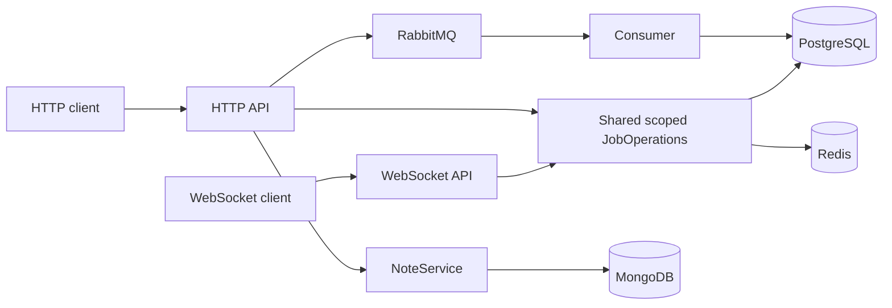

# Connected Lily examples

Three small applications share one application/service package. Every example
package has **only `lilyrs` as its direct Lily dependency**; Serde, Tokio, Diesel,
UUID and other third-party dependencies are declared where used. This is a
separate Cargo workspace with its own lockfile, so these applications are not
published with the framework crates. The clients have another, isolated workspace:
Cargo otherwise unifies their `websocket-client` single-mode DI registration into
server builds and asks the hosts for an unused WebSocket client configuration.
The two workspaces still share the same `models` package.

The example submits a text job over HTTP, processes it through RabbitMQ, stores
its uppercase result in PostgreSQL, and reads it over HTTP or WebSocket. Redis
caches completed results. An independent MongoDB notes endpoint demonstrates the
collection, repository and CRUD service derives. ClickHouse is intentionally not
part of these examples.



## Start with Docker Compose

Requirements: Docker Engine and Docker Compose v2 or newer. The first build
fetches the Rust toolchain image and Cargo dependencies. Run from this directory:

```sh
cd examples  # from the repository root

docker compose up --build -d --wait
# Uses the real Lily HTTP and WebSocket client implementations:
docker compose run --rm client lily-example-client smoke
```

The smoke command returns a JSON object containing the job ID and fails with a
nonzero exit code on any unexpected status, body, Location header or WebSocket
reply. The Consumer must acknowledge the job before its result can be read.

Try the clients individually:

```sh
docker compose run --rm client lily-example-client submit "hello lily"
# Copy the returned UUID into both commands:
docker compose run --rm client lily-example-client get UUID
docker compose run --rm client lily-example-client ws-get UUID
```

| Service | Host endpoint |
| --- | --- |
| HTTP API | `http://127.0.0.1:58100` |
| WebSocket | `ws://127.0.0.1:58101/ws?namespace=jobs` |
| RabbitMQ management | `http://127.0.0.1:55673` (`lily` / `lily_example`) |
| RabbitMQ AMQP | `127.0.0.1:55672` |
| PostgreSQL | `127.0.0.1:55432`, database `lily_examples`, `lily` / `lily_example` |
| MongoDB | `127.0.0.1:57017`, database `lily_examples` |
| Redis | `127.0.0.1:56379` |

All published ports bind to loopback. These are development configurations with
plaintext transport, demo credentials and unauthenticated HTTP/WS, MongoDB and
Redis. The WebSocket server explicitly accepts a missing Origin for these
non-browser clients. Add authentication, browser origin policy and production
transport configuration before adapting this application for deployment.

The hosts receive SIGTERM through Compose's init process. Lily cancels workers,
drains admitted operations, disposes scopes/dependencies, and flushes tracing
within the configured 15-second shutdown budget. Compose allows 25 seconds.

```sh
docker compose stop http-api websocket consumer
# Restart with the same data:
docker compose up -d --wait
# Remove example containers/network; keep the data:
docker compose down
# Optional: also DELETE this example project's database and trace volumes:
docker compose down --volumes
```

## Run Rust processes locally

Requirements: Rust 1.96.1, a C toolchain, PostgreSQL client development libraries
and OpenSSL development libraries (`libpq-dev libssl-dev pkg-config` on Debian).
Keep the infrastructure in Compose, and stop the Compose application containers
before using the same HTTP/WS ports:

```sh
cd examples
docker compose up -d --wait postgres mongodb redis rabbitmq
export LILY_CONFIG_PATH="$PWD/lily.toml"
export LILY_CONFIG_MODE=development
cargo +1.96.1 build --workspace --bins --locked
cargo +1.96.1 build --manifest-path clients/Cargo.toml --locked
```

In three terminals, with those environment variables set:

```sh
cargo +1.96.1 run --locked -p lily-example-consumer
cargo +1.96.1 run --locked -p lily-example-http
cargo +1.96.1 run --locked -p lily-example-websocket
```

Start the Consumer first; it provisions the queue and its retry/dead-letter
topology. Once the hosts are ready, use another terminal:

```sh
cargo +1.96.1 run --locked --manifest-path clients/Cargo.toml -- smoke
cargo +1.96.1 run --locked --manifest-path clients/Cargo.toml -- submit "hello lily"
```

`lily.toml` selects local infrastructure ports. Compose applies canonical
`LILY__...` overrides for internal DNS names and ports. `EXAMPLE_HTTP_BIND`,
`EXAMPLE_WS_BIND`, `EXAMPLE_HTTP_URL`, `EXAMPLE_WS_URL` and `EXAMPLE_RABBIT_URL`
configure example listeners/clients. `custom.worker_interval_ms` is read through
`ConfigService`, validated, and used by the background worker.

## Where to look

| Package / file | What it demonstrates | Facade features |
| --- | --- | --- |
| [models](models/src/lib.rs) | Shared request/reply and versioned queue contracts; no server dependencies | none |
| [shared/services](shared/src/jobs.rs) | Scoped interface injection, singleton dependencies, shared business rules, `async_trait` + `lily_trace(result)` | `injection`, `trace` |
| [shared/repository](shared/src/repository.rs) | `PgDbContext` connection ownership; repository calls join the service transaction | `postgresql` |
| [shared/notes](shared/src/notes.rs) | `MongoCollection`, `Repository`, `CrudService` from one facade | `mongodb` |
| [shared/services](shared/src/jobs.rs) | Confirmed publish with a stable event ID; cache with bounded TTL | `queue-client`, `redis` |
| [shared/worker](shared/src/worker.rs) | One host-owned worker, one new scope per iteration, cancellation, automatic scope disposal | `background-service`, `config`, `injection` |
| [HTTP](http-api/src/main.rs) | Controllers, scoped service extraction, `Accepted`, `Created`, `NoContent`, application error rendering | `http-api` |
| [WebSocket](websocket/src/main.rs) | Same scoped service, JSON payload, correlated ACK or rejection | `websocket` |
| [Consumer](consumer/src/main.rs) | Queue registration, documented AsyncAPI payload, scoped service extraction, retry/permanent errors | `consumer-asyncapi` (also enables `queue`), `error` |
| [clients](clients/src/main.rs) | HTTP requests and correlated WebSocket requests, bounded waits and disconnect | `http-client`, `websocket-client` |

The framework roots continue to expose `Injectable` and `ServiceTrait`; a
service-only package uses `lilyrs::injection`. No `lily_*_derive` or registry package
needs to be added. Feature declarations are explicit in each package manifest.
Do not use `--all-features`: factory and single modes are mutually exclusive.
Factory and transactional-inbox forwarding contracts have separate isolated
fixtures under `tests/fixtures/umbrella_facades`; this example uses single mode
and the normal at-least-once queue contract.

## Data and failure contracts

- `POST /jobs` takes `{ "id": "canonical-non-nil-uuid", "text": "hello" }` and
  returns `202` with a Location header after RabbitMQ confirms publication.
  `GET /jobs/:id` returns `404` while no completed record exists; clients poll
  with a deadline. Accepted does not mean processed.
- The service starts one `PgDbContext.transaction`. The repository inserts a job
  and a processed-event record using `with_connection`; they share the scoped
  connection without passing it through every method. An application
  `DemoError` implements `From<PgError>` and remains the transaction's error type.
- Primary keys and `ON CONFLICT DO NOTHING` make identical deliveries idempotent.
  Both rows commit together before the handler returns and RabbitMQ is ACKed.
  A redelivery after commit rechecks the text and leaves one row in each table.
  An ID with different text is rejected. Concurrent, conflicting submissions
  can both be accepted before either is processed; the losing delivery is
  permanently rejected by the Consumer. This is not a distributed exactly-once
  guarantee and there is no cross-database transaction or HTTP-side outbox.
- Redis only caches completed immutable results for 60 seconds. Cache outages
  fall back to PostgreSQL and emit a safe diagnostic. Pending misses are never
  cached. MongoDB notes are independent of the queue job transaction.
- `/notes` supports POST, GET `/:id`, PUT `/:id` and DELETE `/:id`. The wrapper
  validates input before invoking the generated CRUD service. External payloads
  never expose MongoDB documents or infrastructure error details.
- Expected application errors map to `rejected` and stable uppercase codes
  (`INVALID_INPUT`, `NOT_FOUND`, `CONFLICT`), as required by the HTTP/WS contracts; infrastructure
  failures map to `error`. HTTP rendering preserves that distinction in
  `ResponseWriteOutcome`. Consumer failures explicitly choose permanent or
  retryable settlement. The queue has a finite retry budget and bounded retention.
- The worker stores only an `Arc<ApplicationScopeFactory>`, never a scoped
  repository. Each `run` closure resolves from its supplied Extensions. Its host
  cancellation token is passed to PostgreSQL, and cancellation during shutdown
  is handled as cooperative termination. Transient statistics failures are
  retried on the next bounded interval. Ordinary HTTP/WS/queue sample calls use
  the integrations' operation limits and scope cleanup; they do not claim to
  propagate a request token through every API.

## Tracing

Each host owns a JSONL exporter with a separate `http.jsonl`, `websocket.jsonl`
or `consumer.jsonl`. Files are capped at 8 MiB each with three retained files.
Local files default to `examples/logs`; Compose uses the `traces` volume. Set
`EXAMPLE_LOG_DIR` to change the directory. To use console output instead, set
`EXAMPLE_TRACE_OUTPUT=console` (then no JSONL file is written). Lily's file and
console exporters are mutually exclusive. Verification requires JSONL mode.

`TraceResultError` centralizes the application's outcome/code mapping. The
`result` macro flag is explicit; business payloads are not automatically logged.
The worker and service methods produce lifecycle/duration events. Inspect files
with `docker compose cp http-api:/work/logs/. ./logs/` after creating `./logs`.
The hosts own exporter flushing during shutdown.

## Repeatable verification

The Rust smoke client checks real response bodies, HTTP status and Location,
WebSocket correlation/rejection, and MongoDB create/read/update/delete. The
Python verifier adds actual PostgreSQL row counts, duplicate-delivery settlement,
Redis TTL, absence of the deleted MongoDB document, JSONL lifecycle pairs, identities/durations, HTTP-to-Consumer trace propagation,
HTTP/WS rejection classification, worker iterations and successful bounded shutdown.
It keeps artifacts under `examples/artifacts/` and exits nonzero on failure.
It does not accept `client_disconnect` as a successful HTTP terminal.

For the running Compose stack (Python 3.10+):

```sh
python3 verify.py
```

This **stops the three example application containers** to verify their exit
codes and flushed telemetry. Infrastructure and data remain. Restart with
`docker compose up -d --wait` when you want to continue.

Or let the verifier build/start/stop its own local processes:

```sh
python3 verify.py --local
```

This mode uses the repository's `target` directory by default; change it with
`--target-dir PATH`. Stop any manually started hosts first. It creates only its
own host processes and never deletes database volumes.

Unit/build verification (no running databases required):

```sh
cargo +1.96.1 test --workspace --locked
cargo +1.96.1 test --manifest-path clients/Cargo.toml --locked
cargo +1.96.1 fmt -p lily-example-models -p lily-example-shared -p lily-example-http -p lily-example-websocket -p lily-example-consumer --check
cargo +1.96.1 fmt --manifest-path clients/Cargo.toml --check
# Check components independently to avoid a workspace-wide feature union hiding imports:
for package in lily-example-shared lily-example-http lily-example-websocket lily-example-consumer; do
  cargo +1.96.1 check --locked -p "$package" --all-targets
done
cargo +1.96.1 check --locked --manifest-path clients/Cargo.toml --all-targets
```

The SQL file is applied once when PostgreSQL initializes a new volume. Existing
volumes are retained across restarts; changing the schema file is not a migration
of existing data. Either apply an explicit migration or deliberately reset only
the example volumes using the documented cleanup command.

## Final facade qualification

From the repository root, run `python3 tests/qualification/facade.py --live` to
combine the feature/macro contracts, direct dependency regressions, workspace and
example tests, documentation builds and live example verification. See the
[qualification guide](../tests/qualification/FACADE.md) for individual stages and
coverage limits.

The qualification runner uses a new random Compose project with dynamic loopback
ports and its own data/trace volumes. It verifies and removes only that project's
resources. Normal `docker compose` use keeps the default ports above. The
`EXAMPLE_HTTP_PORT`, `EXAMPLE_WS_PORT`, `EXAMPLE_POSTGRES_PORT`,
`EXAMPLE_MONGO_PORT`, `EXAMPLE_REDIS_PORT`, `EXAMPLE_AMQP_PORT` and
`EXAMPLE_RABBIT_MANAGEMENT_PORT` variables can override published host ports;
`0` lets Docker allocate an available port. `EXAMPLE_IMAGE` selects the app image
tag. These settings do not change the ports used between containers.
